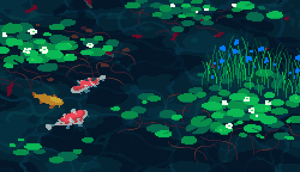

  

<h1 align="center"> Hi 👋 I am Ayse</h2>
I am a fourth-year Computer Engineering student at TOBB University of Economics and Technology. I have a strong interest in the fields of Machine Learning and Deep Learning, and I thoroughly enjoy problem-solving.

Throughout my academic journey, I have gained valuable experience in various areas. I have completed internships at three different companies, where I had the opportunity to work on projects related to web development, mobile development, and cybersecurity. These experiences have equipped me with practical skills and knowledge in these domains.

My passion lies in leveraging the power of Machine Learning and Deep Learning algorithms to solve complex problems and make meaningful contributions. I am constantly seeking to expand my expertise in these areas through self-study and hands-on projects.

I am always eager to collaborate and learn from professionals in the industry. If you would like to get in touch with me or discuss potential opportunities, please feel free to reach out to me through the following links:
<h2>Contact Me!</h2>

[GitHub.io](https://ayse-sadioglu.github.io/Portfolio/)
   

[LinkedIn](https://www.linkedin.com/in/aysesadioglu/)
   

[Twitter](https://twitter.com/daedraedra)

  

